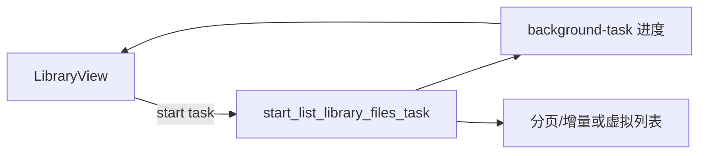

# File Manager — 代码审视与优化建议

> 基于 v0.2.0 代码库通读整理。  
> 涵盖架构、性能、可维护性与产品缺口，供后续迭代排期参考。

---

## 总体评价

项目定位清晰（本机私人资料库），技术选型合理（React 19 + Tauri 2 + Rust），后台任务、通知、托盘等基础设施已成型。

当前主要矛盾是：**部分能力已在 Rust 侧做成异步任务，但前端仍在关键路径上使用同步 IPC**；再叠加几个超大源文件和 JSON 持久化，资料库规模变大后容易遇到性能和可维护性瓶颈。

---

## 高优先级（建议优先处理）

### 1. 资料库列表仍走同步命令，后台任务未被使用 ✅ 已完成

> **完成说明（2026-05-30）**：`LibraryView` 已改用 `start_list_library_files_task`；Rust 命令补充 `directory` 参数以支持文件夹视图；加载过程显示 `TaskProgressPanel` 并支持取消；静默刷新（`library:changed`）在后台更新列表且不阻塞操作按钮。

架构文档（`ARCHITECTURE.md`）写明应使用 `start_list_library_files_task`，但 `LibraryView` 实际调用的是同步的 `list_library_files`：

```tsx
// src/components/LibraryView.tsx
const list = await invoke<LibraryFile[]>("list_library_files", {
  category: listCategoryParam(),
  directory: folderPath,
});
```

Rust 侧已实现带进度与取消的后台版本，前端却完全未调用 `start_list_library_files_task`。

**影响**：文件数量上千时，IPC 会长时间阻塞，UI 卡顿，且无法取消。

**建议**：

- 与 `OverviewView`、`DuplicateView` 一致，改用后台任务 + `TaskProgressPanel` + `background-task` 监听
- 同步版可保留给托盘/脚本等轻量场景，或标注为 deprecated

---

### 2. 全量加载 + 前端过滤，缺少分页/虚拟列表 ✅ 已完成

> **完成说明（2026-05-30）**：列表视图改用 `@tanstack/react-virtual` 虚拟滚动（`VirtualFileList`）；图片网格按行虚拟化，仅渲染可见区域缩略图；Rust 侧统一 `LIBRARY_WALK_MAX_DEPTH = 8`（原 5/8 混用）。Rust 分页/筛选下沉仍留作中期项。

`list_library_files` 每次遍历整个分类（`WalkDir`，`max_depth(5)`），把所有 `LibraryFile` 序列化后传到前端，再由 `libraryFilter.ts` 做搜索/筛选/排序。

**影响**：

- 内存与 IPC 开销随文件数线性增长
- 深层子目录（超过 5 层）的文件不会被列出
- 代码里深度限制不统一（`library.rs` 中有一处 `max_depth(8)`，其余为 5）

**建议**（可分阶段）：

1. **短期**：列表视图加虚拟滚动（如 `@tanstack/react-virtual`）；图片网格按需加载可见区域缩略图
2. **中期**：Rust 侧支持分页/增量返回，或至少把搜索/筛选下沉到 Rust
3. 将 `max_depth` 提取为配置常量并统一

---

### 3. `LibraryView.tsx` 过于庞大（约 1356 行） ✅ 已完成

> **完成说明（2026-05-30）**：拆分为 `useLibraryRefresh`（加载/刷新）、`useLibraryBackgroundTasks`（import/batch/reclassify 后台任务）、`useLibraryDisplayFiles`（筛选/排序派生数据）、`LibraryToolbar`（页头操作区）、`LibraryFileList`（内容区与列表）；`LibraryView.tsx` 缩减为约 500 行，负责 Modal 状态与文件操作编排。

单文件承担了：列表加载、拖拽收纳、批量操作、后台任务监听、预览/重命名/标签/错放整理等。

**建议拆分**：

| 模块                                 | 职责                                      |
| ------------------------------------ | ----------------------------------------- |
| `useLibraryRefresh`                  | 加载与刷新                                |
| `useLibraryBackgroundTasks`          | 统一处理 import / batch / reclassify 事件 |
| `LibraryFileList` / `LibraryToolbar` | 展示与操作区                              |

同类问题也存在于：

| 文件                       | 规模                                          | 问题                                    |
| -------------------------- | --------------------------------------------- | --------------------------------------- |
| `src-tauri/src/lib.rs`     | ~1191 行，53 个 command，7 处 `thread::spawn` | 后台任务 spawn/emit/finish 模式高度重复 |
| `src-tauri/src/library.rs` | ~1495 行                                      | 职责过多，可按 CRUD / 收纳 / 列表拆分   |

**建议**：在 Rust 侧抽成宏或 `spawn_background_task(kind, work_fn)` 辅助函数，减少 `lib.rs` 中的样板代码。

---

### 4. JSON 持久化在规模扩大后会成为瓶颈 ✅ 短期已完成

> **完成说明（2026-05-30）**：`import_log` / `file_metadata` 改为进程内内存缓存（`OnceLock` + `Mutex`），首次访问读盘，后续读写走缓存；变更经 `debounced_persist` 模块 **400ms 防抖**合并落盘；窗口关闭（托盘隐藏）时 `flush_all` 同步写盘。`ImportLogIndex::load` / `MetadataLookup::load` / `list_records` 等均复用缓存，列表加载不再重复解析 JSON。

`import_log.json`、`file_metadata.json` 每次读写都是**整文件**操作。例如 `add_record` 每次收纳都 `load_log` → 修改 → `save_log`；列表加载时还要构建 `ImportLogIndex` 和 `MetadataLookup`。

**影响**：日志/元数据条目到数千级后，收纳和列表刷新都会变慢。

**建议**：

- **中期**：引入 SQLite（或 `sled` / `redb`），至少为 import_log 和 file_metadata 建索引
- ~~**短期**：在内存中缓存 Index，写时 debounce 落盘~~ ✅ 已完成

---

## 中优先级（体验与工程质量）

### 5. 多处静默吞掉错误 ✅ 已完成

> **完成说明（2026-05-31）**：新增 `utils/errors.ts` 统一 `formatError` / `reportError` / `reportToastError`，按场景区分 `toast`（用户应感知）、`warnOnly`（次要加载）、`silent`（可忽略，如取消已结束的后台任务）；`cancelBackgroundTask` 封装取消逻辑；裸 `listen()` 全部改为 `registerListen()`；各视图 `catch` 块改用带上下文的 `reportToastError`，不再 `.catch(() => {})`。

大量 `.catch(() => {})`，例如：

- `App.tsx` 的 `get_library_info`
- `LibraryView` 的 `init_library`
- 各处的 `cancel_background_task`

**建议**：区分「用户可忽略」（取消任务）与「应提示」（初始化失败、配置读取失败）；后者至少 `toastError` 或写 debug 日志。

---

### 6. `background-task` 监听逻辑分散 ✅ 已完成

> **完成说明（2026-05-31）**：新增 `hooks/useBackgroundTask.ts`，统一 `taskId` / `progress` / `assignTask` / `cancelTask` / `isRunning` 状态机，以及 `registerListen("background-task", …)` 与 `finishedTaskIdsRef` 处理；各视图按 kind 声明 `handlers`（`onCompleted` / `onFailed` / `onCancelled`），移除 6 处手写监听。

至少 6 处各自 `listen("background-task", ...)`：

| 文件                  | 监听的任务类型                |
| --------------------- | ----------------------------- |
| `LibraryView.tsx`     | import、batch、reclassify     |
| `DuplicateView.tsx`   | scan-duplicates、batch-delete |
| `OverviewView.tsx`    | scan-directory                |
| `LogsView.tsx`        | batch-restore                 |
| `SettingsView.tsx`    | set-library-root、import      |
| `AppToastContext.tsx` | import（通知）                |

**建议**：封装 `useBackgroundTask(kind, handlers)` 或全局 `BackgroundTaskProvider`，减少重复的状态机代码（`taskIdRef`、`finishedTaskIdsRef`、`isBackgroundTaskRunning` 等已在 `taskProgress.ts` 有部分抽象，可继续扩展）。

---

### 7. 媒体元数据无缓存 ✅ 已完成

> **完成说明（2026-05-31）**：Rust 侧新增 `media_cache.rs`，`%APPDATA%\FileManager\media_cache.json` 按 `(path, mtime, size)` 失效，命中则跳过 Symphonia/ffprobe 解析，变更经 `debounced_persist` 防抖落盘；前端 `utils/mediaInfoCache.ts` 提供 session 缓存，`useMediaInfo` 仅对未缓存文件发起 `get_media_info_batch`。

`useMediaInfo` 在视频/音频分类切换时，对**全部可见文件**批量调用 `get_media_info_batch`，每次路径变化都重新解析（Symphonia / Lofty 读文件头）。

**建议**：

- Rust 侧加 `%APPDATA%\FileManager\media_cache.json` 或 SQLite，按 `(path, mtime, size)` 做失效
- 前端对已解析路径做 session 缓存

---

### 8. 查重哈希算法 ✅ 已完成

> **完成说明（2026-05-31）**：`duplicate.rs` 将 FNV-1a 换为 **BLAKE3**（256 位，碰撞风险更低、性能相近）；保留 `split_exact_groups` 字节级二次校验，哈希碰撞不会误报重复；查重页补充「删除前请人工核对」说明，哈希展示截断为前 16 字符（完整值在 tooltip）。

`duplicate.rs` 使用 FNV-1a 非加密哈希。对查重场景通常够用，但存在极低概率的哈希碰撞误报。

**建议**：若用户可能处理大量大文件，可换 `xxhash` 或 `blake3`（性能相近、碰撞风险更低），或在 UI 上标注「建议人工确认」。

---

### 9. 缺少自动化质量保障 ✅ 已完成

> **完成说明（2026-05-31）**：新增 ESLint 9（TypeScript + React Hooks 经典规则）与 Prettier；`package.json` 提供 `lint` / `format:check` / `test`（Vitest）；为 `taskProgress.ts`、`libraryFilter.ts` 补充 25 个单元测试；`.github/workflows/ci.yml` 在 PR/push 时跑 `tsc`、`lint`、`format:check`、`vitest`、`cargo test`、`cargo clippy`；修复 Windows 下 `library.rs` 路径守卫测试与 `canonicalize` 前缀不一致问题。

| 项目              | 现状                                                         |
| ----------------- | ------------------------------------------------------------ |
| ESLint / Prettier | ✅ `eslint.config.js`、`.prettierrc`                         |
| 前端测试          | ✅ Vitest（`taskProgress`、`libraryFilter`）                 |
| Rust 单元测试     | ✅ 多模块 + CI `cargo test`                                  |
| CI                | ✅ `ci.yml`（类型检查 / lint / test / clippy）               |

**建议**：至少加 `npm run lint`、`cargo test`、`cargo clippy` 的 CI workflow；前端对 `taskProgress.ts`、`libraryFilter.ts` 等纯函数补测试，成本低、收益高。

---

### 10. 样式单文件约 3545 行 ✅ 已完成

> **完成说明（2026-05-31）**：原 `styles.css`（约 3675 行）拆分为 `src/styles/` 下 13 个按职责划分的 CSS 文件（`base`、`sidebar`、`shared`、`library`、`overview`、`drop-zone`、`theme`、`settings`、`modals`、`image-grid`、`preview`、`logs`、`duplicate`），由 `index.css` 统一 `@import`；`main.tsx` 改引 `./styles/index.css`。未采用 CSS Modules，保持现有 class 名不变，改动面最小。

`styles.css` 集中所有视图样式，维护成本高。

**建议**：按视图/组件拆分为 CSS Modules，或按 `LibraryView.css`、`DuplicateView.css` 等分文件 import（改动面小，不必上 CSS-in-JS）。

---

## 低优先级 / 产品向

以下方向在 `功能规划建议.md` 中已有部分标注，此处汇总供排期参考。

| 方向                | 现状                                           | 价值             |
| ------------------- | ---------------------------------------------- | ---------------- |
| 收件箱工作流        | 分类目录存在，但「先进收件箱再确认分类」未实现 | 降低误收纳焦虑   |
| 总览页查重入口      | 仅资料库内查重                                 | 与产品设计衔接   |
| 资源管理器右键收纳  | 未做                                           | Windows 习惯衔接 |
| 操作撤销            | 删除走回收站，收纳无撤销                       | 提升「放心收纳」 |
| 无障碍              | 部分 Modal 有 `aria-*`，主列表/表格缺失        | 键盘导航与读屏   |
| 按大小跳过收纳      | 未做                                           | 过滤临时小文件   |
| 视频/音频元数据增强 | 基础时长/编码/封面已有                         | 进一步丰富展示   |

---

## 架构示意

### 当前列表加载


### 建议目标



---

## 建议实施顺序

| 阶段         | 内容                                                                                                       | 说明                      |
| ------------ | ---------------------------------------------------------------------------------------------------------- | ------------------------- |
| **~~立刻~~** | ~~`LibraryView` 改用 `start_list_library_files_task`~~ ✅ 已完成                                           | 改动集中、用户感知最强    |
| **短期**     | ~~拆分 `LibraryView` + 抽象 `useBackgroundTask`~~ ✅ 已完成 + ~~统一错误上报~~ ✅ 已完成 + ~~补 CI lint/test~~ ✅ 已完成 | 降低后续改动成本          |
| **短期**     | ~~列表虚拟化 + 图片网格按需渲染 + 统一 `max_depth`~~ ✅ 已完成                                             | 支撑更大资料库的前端渲染  |
| **中期**     | ~~Rust 分页/筛选下沉~~ 仍待后续 + ~~媒体元数据缓存~~ ✅ 已完成                                             | 降低 IPC 与内存           |
| **长期**     | SQLite 替代 JSON 存储；收件箱/总览查重等产品功能                                                           | 按 `功能规划建议.md` 排期 |

---

## 相关文档

- [架构说明](./ARCHITECTURE.md)
- [功能规划建议](./功能规划建议.md)

---

_文档生成日期：2026-05-30_
